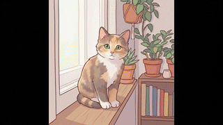

# Vision Skills

This repository provides vision-related Agent Skills.
- [image-generation](./skills/image-generation): Gemini (Nano Banana) text-to-image, image editing, and multi-image composition
- [video-generation](./skills/video-generation): Gemini Veo image-to-video / text-to-video
- [bbdown-cli](./skills/bbdown-cli): Install and use BBDown CLI for Bilibili downloads (login/cookies/access_token, prefer 720p, output to data/)

## Installation
```bash
git clone https://github.com/Xiangyu-CAS/Vision-Skills.git

cd Vision-Skills

# codex
cp -r skills/* .codex/skills/
# claude
cp -r skills/* .claude/skills/
``` 
**Environment variable**: Gemini skills require an API key. Configure it before use:
```bash
export GEMINI_API_KEY="YOUR_KEY"
```

## Examples
<table>
  <tr>
    <th></th>
    <th>Conversation</th>
    <th>Result</th>
  </tr>
  <tr>
    <td>Image generation</td>
    <td></td>
    <td></td>
  </tr>
  <tr>
    <td>Image editing</td>
    <td></td>
    <td></td>
  </tr>
  <tr>
    <td>Video generation</td>
    <td></td>
    <td></td>
  </tr>
</table>
