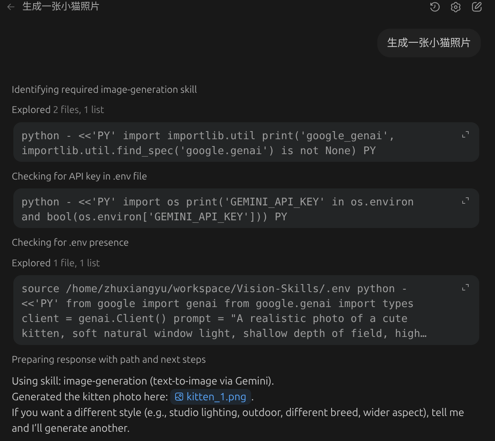
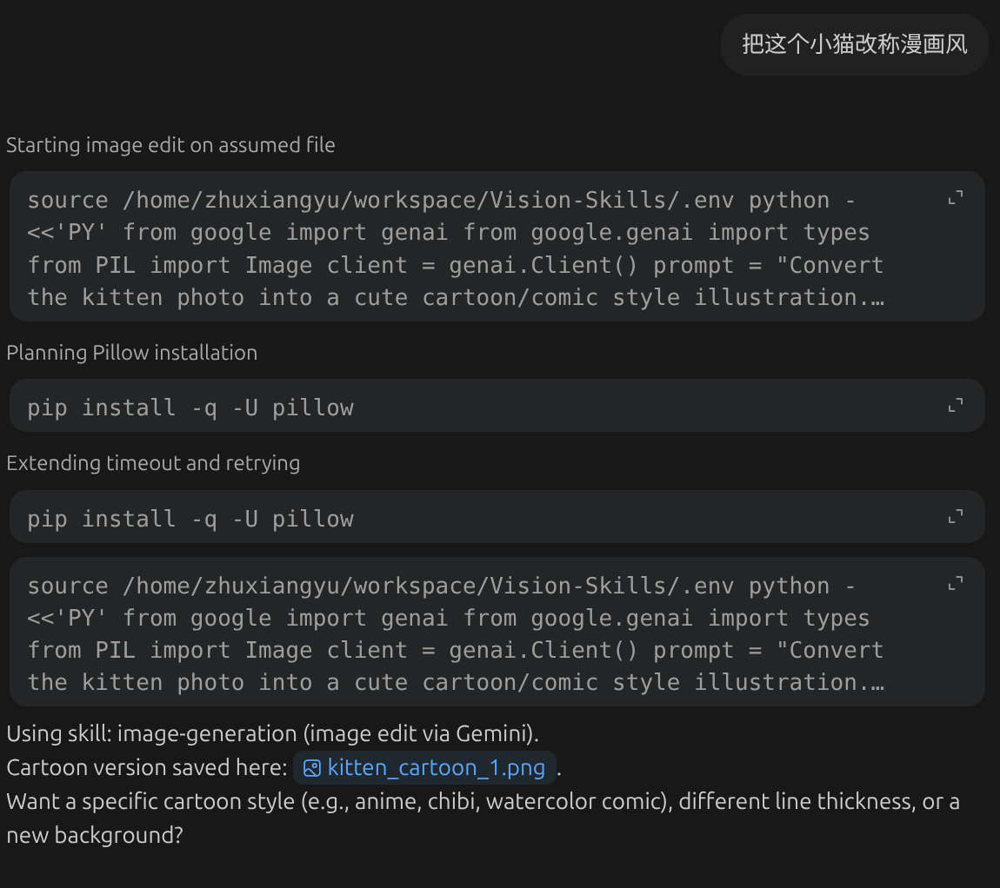
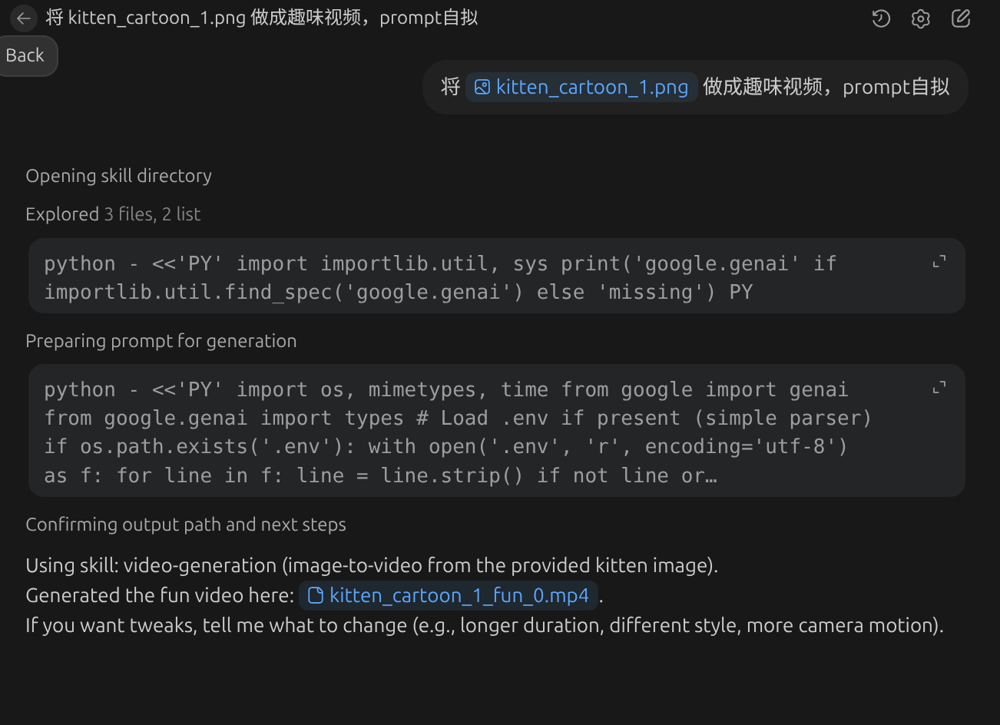

# Vision Skills

本仓库实现了视觉相关Agent Skills
- 图像生成/编辑：基于 Gemini (Nano Banana)的文生图、图像编辑、多图合成
- 视频生成：基于 Gemini Veo 的图生视频/文生视频

**配置环境变量**
由于 Gemini 相关技能需要 API Key，请在使用前配置环境变量：
```bash
export GEMINI_API_KEY="YOUR_KEY"
```

## examples
<table>
  <tr>
    <th></th>
    <th>skill运行过程</th>
    <th>结果</th>
  </tr>
  <tr>
    <td>图像生成</td>
    <td></td>
    <td></td>
  </tr>
  <tr>
    <td>图像编辑</td>
    <td></td>
    <td></td>
  </tr>
  <tr>
    <td>视频生成</td>
    <td></td>
    <td><video src="assets/kitten_cartoon_1_fun_0.mp4" width="320" controls loop muted></video></td>
  </tr>
</table>
